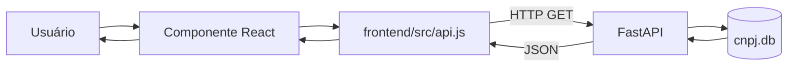
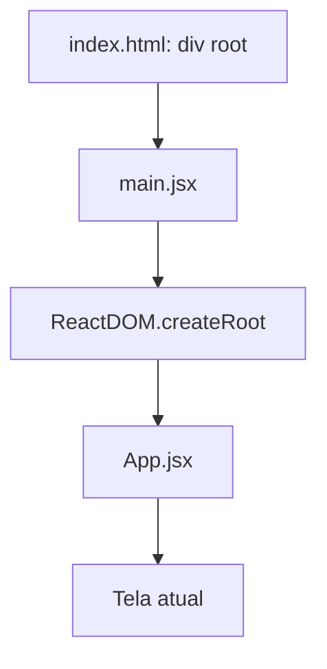
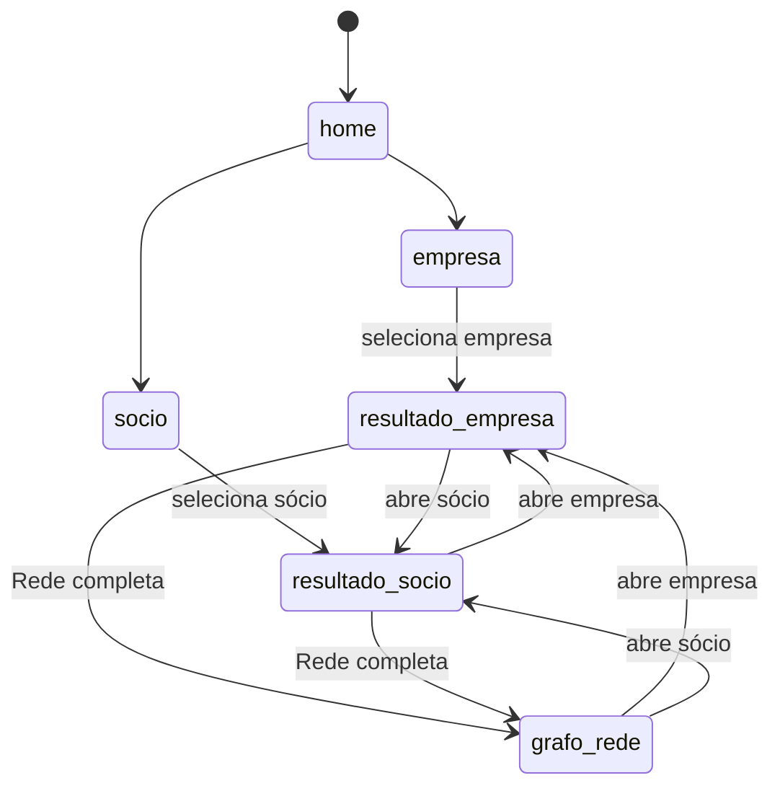
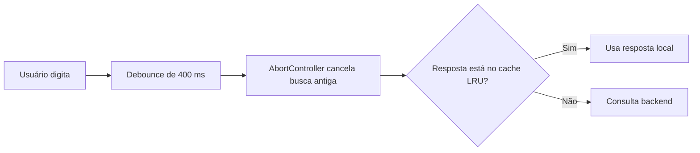
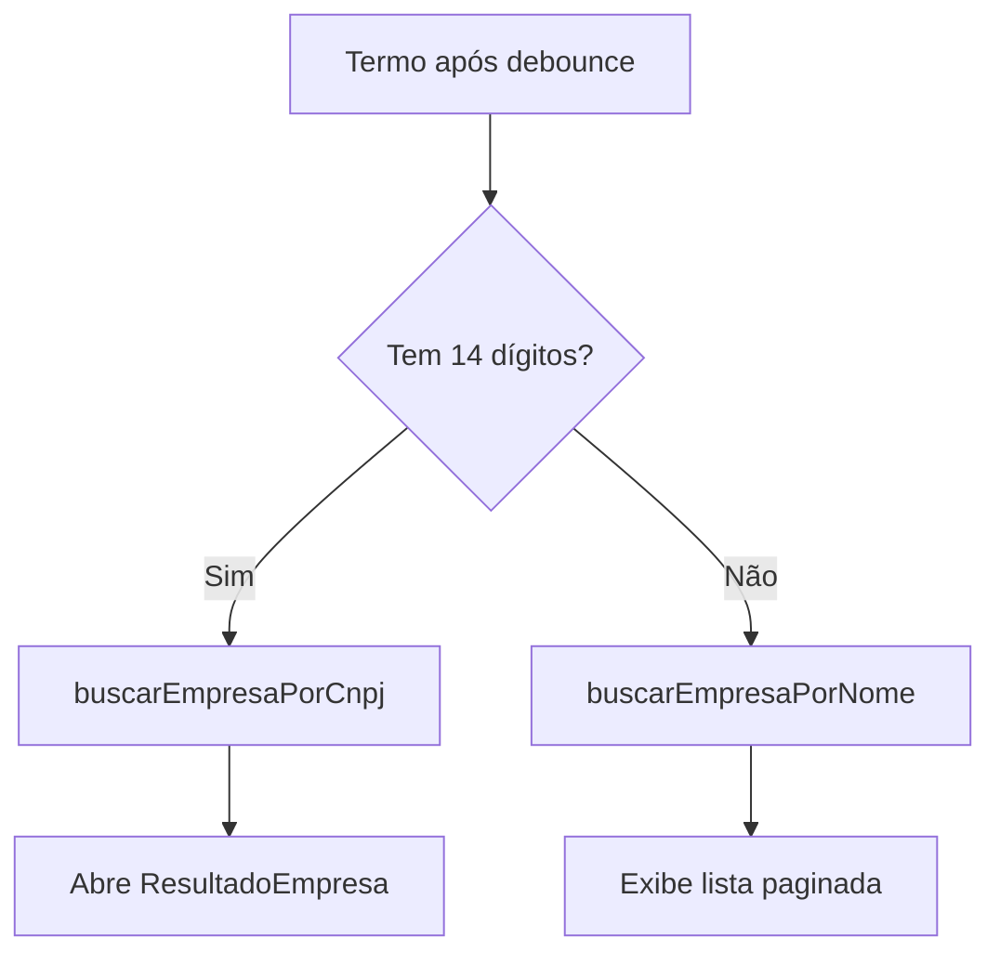
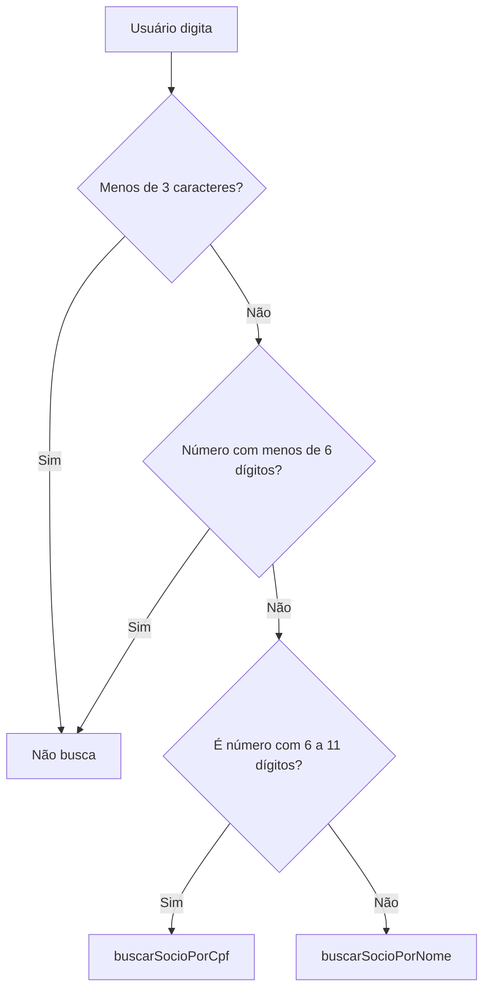
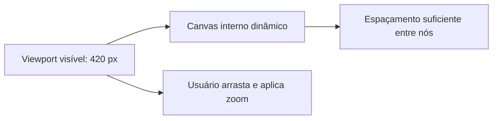
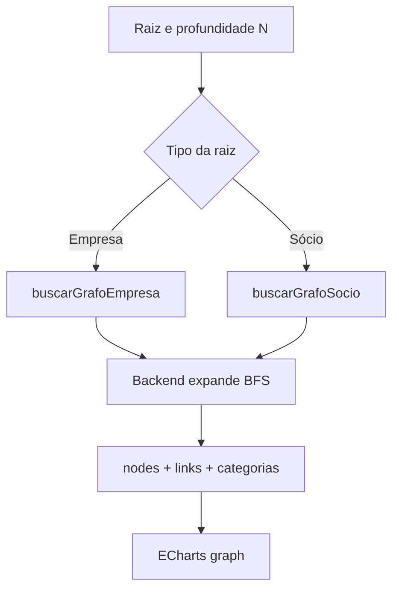
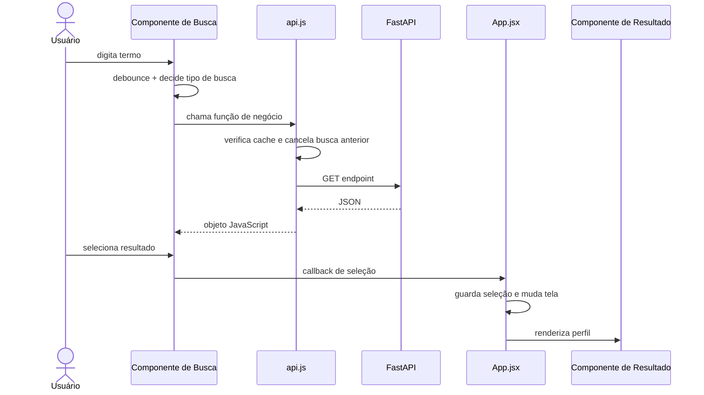

# Guia de Estudo do Frontend

Este documento explica o frontend do projeto de forma detalhada, seguindo o
código real. O objetivo é permitir entender:

- como o React inicia a aplicação;
- como as telas são controladas;
- como o frontend chama a API;
- como funcionam as buscas em tempo real;
- como os resultados são exibidos;
- como funcionam o mapa compacto e a rede completa;
- como os dados e eventos passam entre os componentes.

---

## 1. Visão geral

O frontend está em `frontend/` e usa:

- **React** para componentes, estado e interação;
- **Vite** para desenvolvimento e geração do build;
- **ECharts** para os mapas de relacionamento;
- **Fetch API** para requisições HTTP ao backend;
- **localStorage** para guardar perfis acessados recentemente;
- **Tailwind/classes CSS** e `App.css` para a interface.

O frontend não acessa o SQLite diretamente. Toda informação vem do backend:



---

## 2. Estrutura dos arquivos

```text
frontend/src/
├── main.jsx
├── App.jsx
├── api.js
├── App.css
└── components/
    ├── Login.jsx
    ├── Sidebar.jsx
    ├── HomeSelecao.jsx
    ├── BuscaEmpresa.jsx
    ├── BuscaSocio.jsx
    ├── ResultadoEmpresa.jsx
    ├── ResultadoSocio.jsx
    ├── RedeTree.jsx
    └── GrafoRede.jsx
```

### Responsabilidade de cada arquivo

| Arquivo | Responsabilidade |
|---|---|
| `main.jsx` | Inicia o React e renderiza `App` |
| `App.jsx` | Controla a tela atual e a navegação entre componentes |
| `api.js` | Centraliza todas as chamadas HTTP, cache e cancelamento |
| `App.css` | Estilos globais e configuração visual |
| `Login.jsx` | Tela visual de login; atualmente não autentica no backend |
| `Sidebar.jsx` | Menu lateral, atalhos e histórico recente |
| `HomeSelecao.jsx` | Tela inicial para escolher pesquisa por empresa ou sócio |
| `BuscaEmpresa.jsx` | Busca em tempo real por nome ou CNPJ |
| `BuscaSocio.jsx` | Busca em tempo real por nome ou CPF |
| `ResultadoEmpresa.jsx` | Perfil detalhado de uma empresa |
| `ResultadoSocio.jsx` | Perfil detalhado de um sócio |
| `RedeTree.jsx` | Mapa compacto hierárquico até N2 |
| `GrafoRede.jsx` | Rede completa interativa com nós e arestas |

---

## 3. Inicialização: `main.jsx`

`main.jsx` é o ponto de entrada do frontend.

Fluxo:

1. Importa React, ReactDOM, `App` e o CSS global.
2. Localiza o elemento HTML com `id="root"`.
3. Cria a raiz React.
4. Renderiza o componente `App`.
5. Usa `React.StrictMode` para ajudar a encontrar comportamentos problemáticos
   durante o desenvolvimento.



`StrictMode` pode executar alguns efeitos duas vezes no ambiente de
desenvolvimento. Isso não acontece da mesma maneira no build de produção.

---

## 4. Controle central: `App.jsx`

`App.jsx` funciona como o coordenador da aplicação. O projeto não usa uma
biblioteca de rotas como React Router. Em vez disso, guarda a tela atual em
estado e renderiza o componente correspondente.

### Estados principais

| Estado | Conteúdo |
|---|---|
| `tela` | Nome da tela atual, como `home`, `empresa` ou `resultado-socio` |
| `telaAnterior` | Tela usada pelo botão de voltar |
| `empresaDetalhe` | Dados da empresa selecionada |
| `socioInicial` | Dados básicos do sócio selecionado |
| `grafoRaiz` | Identificação da raiz da rede completa |
| `loadingNav` | Mostra carregamento ao abrir empresa somente por CNPJ |

### Telas possíveis

```text
login
home
empresa
socio
resultado-empresa
resultado-socio
grafo-rede
```

### Funções de navegação

#### `irPara(proxTela)`

Guarda a tela atual em `telaAnterior` e muda para a próxima tela.

#### `abrirEmpresa(cnpjOuDados)`

Aceita dois tipos de entrada:

- objeto já carregado: abre diretamente o resultado;
- string/CNPJ: chama `buscarEmpresaPorCnpj` antes de abrir.

Também registra a empresa no histórico recente.

#### `abrirSocio(item)`

Guarda os dados básicos do sócio, registra no histórico e abre
`ResultadoSocio`.

O perfil completo ainda não é carregado aqui. Isso acontece dentro de
`ResultadoSocio`.

#### `abrirGrafo(raiz)`

Recebe a raiz do grafo, por exemplo:

```js
{ tipo: "empresa", cnpj: "...", label: "..." }
```

ou:

```js
{ tipo: "socio", cpf: "...", nome: "...", label: "..." }
```

Depois abre a tela `grafo-rede`.

### Fluxo de navegação



### Histórico recente

As funções `addRecenteEmpresa` e `addRecenteSocio` usam `localStorage`.

Importante:

- são registrados **cliques em perfis**, não cada texto digitado;
- cada lista guarda no máximo 10 itens;
- registros repetidos são removidos antes de inserir o mais recente;
- o histórico pertence ao navegador atual, não ao banco.

---

## 5. Comunicação com a API: `api.js`

`api.js` separa os componentes da implementação HTTP. Os componentes chamam
funções com nomes de negócio, sem montar URLs manualmente.

### URL base

```js
const BASE_URL = import.meta.env.VITE_API_URL || "http://localhost:8000";
```

- em desenvolvimento, usa `http://localhost:8000`;
- em produção, usa `VITE_API_URL`, definido no ambiente/build.

### Função `_get(path, signal)`

É a base de todas as requisições:

1. executa `fetch`;
2. transforma HTTP 404 em `null`;
3. para outros erros, tenta extrair `detail` da resposta;
4. transforma JSON em objeto JavaScript.

### Cache LRU em memória

O arquivo mantém um `Map` com no máximo 100 respostas.

LRU significa **Least Recently Used**:

- ao acessar um item, ele vai para o final da fila;
- quando o limite é atingido, o menos usado é removido;
- o cache desaparece quando a página é recarregada.

Ele evita repetir consultas idênticas durante a mesma sessão.

### Cancelamento com `AbortController`

Existem controladores separados para busca de empresa e busca de sócio.

Quando uma nova busca começa:

1. a requisição anterior daquele tipo é cancelada;
2. uma nova requisição é criada;
3. respostas antigas deixam de disputar com o texto mais recente.

Isso é essencial na busca em tempo real.

### Funções públicas de `api.js`

| Função | Endpoint |
|---|---|
| `fetchInfo()` | `GET /api/v1/info` |
| `buscarEmpresaPorCnpj(cnpj)` | `GET /api/v1/empresa/{cnpj}` |
| `buscarEmpresaPorNome(nome, skip, limit, knownTotal)` | `GET /api/v1/empresa/busca` |
| `buscarPerfilSocio(cpf, nome)` | `GET /api/v1/socio/perfil` |
| `buscarSocioPorNome(...)` | `GET /api/v1/socio/busca?nome=...` |
| `buscarSocioPorCpf(...)` | `GET /api/v1/socio/busca?cpf=...` |
| `buscarEmpresaRede(cnpj)` | `GET /api/v1/empresa/{cnpj}/rede` |
| `buscarGrafoEmpresa(cnpj, profundidade)` | `GET /api/v1/empresa/{cnpj}/grafo` |
| `buscarGrafoSocio(cpf, nome, profundidade)` | `GET /api/v1/socio/grafo` |

### Três camadas de economia de requisições



---

## 6. Busca de empresa: `BuscaEmpresa.jsx`

Permite pesquisar por:

- razão social;
- nome fantasia;
- CNPJ completo.

### Estados importantes

| Estado | Uso |
|---|---|
| `termo` | Texto digitado |
| `lista` | Resultado paginado |
| `pagina` | Quantidade de registros pulados (`skip`) |
| `ultimoTermo` | Termo associado à lista atual |
| `loading` | Indica consulta em andamento |
| `erro` | Mensagem de erro |
| `recentes` | Histórico lido do `localStorage` |

### Busca em tempo real

Um `useEffect` observa `termo`.

1. Com menos de 3 caracteres, não busca.
2. A cada alteração, cancela o temporizador anterior.
3. Espera 400 ms sem nova digitação.
4. Chama `executarBusca`.

Esse atraso é o **debounce**. Ele evita uma requisição para cada tecla.

### Decisão entre nome e CNPJ

`ehCnpj` considera CNPJ quando há exatamente 14 dígitos.



O componente também calcula a validade matemática do CNPJ para informar o
usuário, mas a busca pelo CNPJ é realizada quando existem 14 dígitos.

### Paginação

- `LIMIT = 20`;
- `pagina` representa o `skip`, não o número visual da página;
- ao mudar de página, envia `known_total`;
- o backend pode reutilizar esse total e evitar um novo `COUNT`.

### Ao selecionar uma empresa da lista

A lista traz dados resumidos. O clique chama nova busca usando o CNPJ completo
e somente depois abre o perfil detalhado.

---

## 7. Busca de sócio: `BuscaSocio.jsx`

Permite pesquisar por:

- nome do sócio;
- CPF completo;
- os 6 dígitos visíveis do CPF anonimizado da Receita.

### Particularidade do CPF

Na base pública, CPF de pessoa física normalmente aparece mascarado:

```text
***123456**
```

O sistema não possui os três primeiros nem os dois últimos dígitos. A busca
converte um CPF completo informado pelo usuário para os seis dígitos que
podem ser comparados com a base.

### Decisão atual entre CPF e nome

`ehCpf` considera busca por CPF no frontend quando o texto:

- possui apenas números, espaços, pontos ou hífen;
- contém entre 6 e 11 dígitos.

Com 1 a 5 dígitos, `cpfEmDigitacao` impede a busca. A partir de 6, o sistema
consulta como CPF.

Há uma diferença importante entre frontend e backend: `_cpf_mascarado_rf`, no
backend, aceita somente **6 dígitos visíveis** ou **11 dígitos do CPF
completo**. Portanto, entradas numéricas com 7 a 10 dígitos atualmente são
classificadas como CPF pelo frontend, mas retornam lista vazia. Esse é um ponto
de melhoria conhecido.



### Proteção extra contra respostas antigas

Além do `AbortController` de `api.js`, o componente usa `searchIdRef`.

Cada busca recebe um número crescente. Uma resposta só atualiza a tela se seu
número ainda for o mais recente. Isso evita que uma resposta lenta substitua
uma resposta mais nova.

### Resultado resumido

Cada item mostra:

- nome;
- CPF/CNPJ mascarado ou documento disponível;
- tipo ou faixa etária;
- número de empresas ativas;
- número de empresas inaptas;
- número de vínculos anteriores.

Ao clicar, o item resumido é enviado para `App.jsx`, que abre
`ResultadoSocio`.

---

## 8. Perfil da empresa: `ResultadoEmpresa.jsx`

Recebe em `dados` o objeto detalhado já retornado por
`GET /api/v1/empresa/{cnpj}`.

### Informações exibidas

- CNPJ, razão social e nome fantasia;
- situação cadastral e situação especial;
- datas e capital social;
- atividade econômica principal e secundárias;
- natureza jurídica, porte, Simples e MEI;
- endereço e contatos;
- sócios ativos;
- ex-sócios;
- estabelecimentos ativos e inativos;
- mapa compacto de relacionamentos.

### Tratamento de sócios

O componente separa e ordena:

- pessoas físicas antes de pessoas jurídicas;
- administradores, diretores e presidentes em destaque;
- sócios ativos e inativos em seções diferentes.

Ao clicar em um sócio:

- se for pessoa jurídica com CNPJ disponível, abre a empresa;
- caso contrário, abre o perfil de sócio.

### Carregamento preguiçoso do mapa compacto

O mapa não é carregado junto com o perfil.

1. O usuário abre a seção “Mapa de Relacionamentos”.
2. `toggleRede` chama `carregarRede`.
3. `buscarEmpresaRede` consulta `/api/v1/empresa/{cnpj}/rede`.
4. A resposta é guardada em `redeData`.
5. `RedeEmpresa` desenha a árvore.

Se a seção for fechada e aberta novamente, os dados já carregados são
reutilizados.

### Rede completa

O botão “Rede completa” envia uma raiz para `App.jsx`:

```js
{
  tipo: "empresa",
  cnpj: "...",
  label: "Razão Social"
}
```

Depois, `App` abre `GrafoRede`.

---

## 9. Perfil do sócio: `ResultadoSocio.jsx`

Ao receber `socioInicial`, o componente ainda possui somente os dados resumidos.
Ele precisa buscar o perfil completo.

### Fluxo de carregamento

1. Extrai CPF e nome do item selecionado.
2. Chama `buscarPerfilSocio(cpf, nome)`.
3. O backend reúne empresas e relações.
4. Guarda o resultado em `perfil`.
5. Renderiza as seções.

### Informações exibidas

- identificação e faixa etária disponível;
- resumo de vínculos;
- empresas ativas;
- empresas inativas/ex-empresas;
- sócios em comum;
- ex-sócios em comum;
- atividades econômicas relacionadas;
- capital social agregado;
- mapa compacto de relacionamentos.

### Sócios em comum

Não significa necessariamente que duas pessoas são sócias diretamente entre
si. Significa que aparecem ligadas a pelo menos uma mesma empresa.

### Mapa compacto

`MapaRelacionamentos` recebe o próprio `perfil`. Diferente da empresa, não
precisa fazer uma nova chamada para o mapa compacto, pois o perfil já contém
as informações necessárias para montar a árvore.

---

## 10. Mapa compacto: `RedeTree.jsx`

O mapa compacto usa a série `tree` do ECharts. Ele representa uma hierarquia:

```text
raiz
└── nós N1
    └── nós N2
```

### Dois componentes exportados

#### `RedeEmpresa`

Recebe uma árvore pronta do backend por `/empresa/{cnpj}/rede`.

Exemplo conceitual:

```text
Empresa raiz
└── Sócio
    └── Outras empresas desse sócio
```

#### `RedeSocio`

Monta a árvore no próprio frontend usando o perfil do sócio:

```text
Sócio raiz
└── Empresa ou ex-empresa
    └── Outros sócios ligados àquela empresa
```

### Funções importantes

| Função | Papel |
|---|---|
| `nodeCategory` | Descobre a categoria visual do nó |
| `filterTree` | Remove categorias ocultadas pela legenda |
| `countNodes` | Conta nós para dimensionar o canvas |
| `maxDepth` | Descobre profundidade máxima |
| `treeHeight` | Calcula altura interna da árvore |
| `treeWidth` | Calcula largura interna |
| `styleNode` | Aplica cor, rótulo e metadados |
| `makeOption` | Cria configuração do ECharts |
| `useTreeChart` | Inicializa e atualiza o gráfico |
| `Legend` | Permite mostrar/ocultar categorias |
| `TreeViewport` | Mantém janela visual compacta de 420 px |

### Canvas grande dentro de viewport pequeno

O gráfico pode precisar de milhares de pixels internos para evitar
sobreposição. Mesmo assim, a seção da página fica com altura fixa.



### Interações

- arrastar para navegar;
- zoom;
- clicar nos itens da legenda para filtrar;
- clicar nos nós para abrir empresa ou sócio relacionado.

---

## 11. Rede completa: `GrafoRede.jsx`

A rede completa é diferente do mapa compacto.

Ela usa a série `graph` do ECharts e recebe:

- lista plana de `nodes`;
- lista plana de `links`;
- categorias;
- metadados sobre profundidade e truncamento.

### Busca do dataset

Quando a raiz ou a profundidade muda:



### Profundidade

Profundidade representa quantos saltos de relacionamento serão explorados:

- raiz empresa, N1: seus sócios;
- N2: empresas relacionadas aos sócios;
- N3: sócios das empresas N2;
- e assim por diante.

O frontend permite até N10, mas pode impedir expansões quando a rede já está
grande demais ou quando o backend informa que não há mais níveis úteis.

### Proteção contra redes excessivas

Limites de pré-visualização:

- `MAX_PREVIEW_NODES = 2000`;
- `MAX_PREVIEW_LINKS = 3500`.

Acima disso, o frontend evita incentivar uma profundidade maior. Redes grandes
também entram em “modo leve”, reduzindo efeitos visuais e animações.

### Recursos disponíveis

- filtro por categoria;
- mostrar ou ocultar ex-vínculos;
- busca textual dentro do grafo;
- seleção encadeada de nós vizinhos;
- cálculo do menor caminho até a raiz;
- limpar seleção;
- troca de profundidade;
- tela cheia;
- zoom;
- pan customizado, inclusive sobre áreas vazias;
- duplo clique para abrir o perfil de empresa ou sócio.

### Seleção e caminho até a raiz

Quando um nó é selecionado, o sistema destaca conexões próximas. O botão para
conectar até a raiz calcula o menor caminho usando uma busca em largura sobre
os links atualmente permitidos pelos filtros.

### Pan e zoom customizados

O componente usa eventos do `zrender`, camada gráfica interna do ECharts:

- `mousedown` inicia o movimento;
- `mousemove` desloca o grafo;
- `mouseup` encerra;
- roda do mouse aplica zoom com origem no cursor.

Isso permite comportamento semelhante a ferramentas de desenho.

---

## 12. Componentes de apoio

### `HomeSelecao.jsx`

- apresenta as duas entradas principais: empresa e sócio;
- chama `/api/v1/info` para mostrar o mês atual da base;
- não realiza buscas diretamente.

### `Sidebar.jsx`

- navega entre home, busca de empresa e busca de sócio;
- lê o histórico do `localStorage`;
- ao clicar em recente, chama funções recebidas de `App.jsx`;
- também mostra o mês atual da base.

### `Login.jsx`

É atualmente uma tela visual. O envio chama `onLogin` sem validar usuário e
senha em uma API. Portanto, ainda não é um sistema real de autenticação.

---

## 13. Conceitos React usados no projeto

### `useState`

Guarda valores que alteram a interface, como texto digitado, resultado,
carregamento, filtros e tela atual.

### `useEffect`

Executa efeitos externos ou reações a mudanças:

- buscar após digitação;
- carregar perfil;
- criar/destruir gráficos;
- observar fullscreen;
- atualizar informações quando a raiz muda.

### `useRef`

Guarda referências que não precisam causar nova renderização:

- elemento HTML do gráfico;
- temporizador de debounce;
- instância ECharts;
- identificador da busca mais recente;
- dados usados por callbacks.

### `useMemo`

Evita recalcular estruturas caras em toda renderização:

- árvores filtradas;
- contagens;
- conjuntos de nós encontrados;
- profundidades disponíveis.

### `useCallback`

Mantém uma função estável entre renderizações, útil em callbacks passados a
outros componentes ou efeitos.

### Props

São dados e callbacks enviados do componente pai para o filho.

Exemplo:

```text
App
└── ResultadoEmpresa
    ├── dados
    ├── onVoltar
    ├── onVerSocio
    ├── onVerEmpresa
    └── onAbrirGrafo
```

O filho não decide sozinho como navegar. Ele comunica a intenção ao pai por
uma função callback.

---

## 14. Fluxo completo resumido do frontend



---

## 15. Pontos importantes para explicar em uma prova

1. O frontend não fala com o banco; fala somente com a API.
2. `App.jsx` controla navegação por estado, sem React Router.
3. `api.js` centraliza URLs, erros, cache e cancelamento.
4. Busca em tempo real usa debounce para reduzir consultas.
5. `AbortController` e `searchIdRef` impedem respostas antigas.
6. Resultados resumidos e perfis completos são consultas diferentes.
7. O mapa compacto é uma árvore hierárquica até N2.
8. A rede completa usa nós e arestas e pode expandir profundidades.
9. O perfil de empresa já chega completo; o perfil de sócio é carregado pelo
   próprio `ResultadoSocio`.
10. A tela de login ainda é somente visual.

---

## 16. Limitações atuais do frontend

- não possui autenticação real;
- não usa URLs próprias para cada tela/perfil;
- recarregar a página perde a navegação atual;
- cache LRU existe apenas enquanto a aba está aberta;
- busca de CPF aceita os seis dígitos visíveis como busca, o que pode gerar
  muitos homônimos/resultados;
- a interface classifica 7 a 10 dígitos como CPF, embora o backend aceite
  somente 6 ou 11;
- ainda não existe busca combinada por nome + CPF na interface;
- redes muito grandes precisam ser limitadas para preservar usabilidade.
