# Guia de Fluxos Ponta a Ponta

Este documento descreve como a informação percorre o sistema inteiro, desde os
arquivos públicos da Receita Federal até a tela apresentada ao usuário.

Ele complementa:

- `banco.md`: operação e comandos da carga;
- `guia_estudo_backend.md`: arquitetura do backend;
- `guia_funcoes_crud.md`: funções de consulta;
- `guia_estudo_frontend.md`: funcionamento do frontend.

---

## 1. Mapa geral do sistema

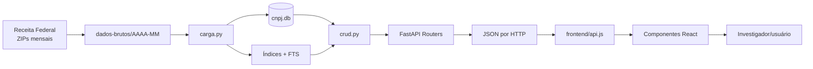

O sistema possui dois grandes momentos:

1. **Preparação offline:** baixar, organizar e indexar os dados.
2. **Consulta online:** receber uma pesquisa e devolver resultados rapidamente.

---

## 2. Fluxo para povoar o banco

### 2.1 Origem dos dados

Os dados vêm de snapshots públicos mensais da Receita Federal. Cada mês pode
conter vários ZIPs para tabelas grandes e um ZIP para tabelas menores.

Principais grupos:

| Grupo de arquivos | Conteúdo |
|---|---|
| `Empresas*.zip` | Dados da entidade empresarial pelo CNPJ básico |
| `Estabelecimentos*.zip` | Matriz/filiais, situação, endereço, CNAE e contato |
| `Socios*.zip` | Vínculos societários |
| `Simples*.zip` | Simples Nacional e MEI |
| `Cnaes*.zip` | Domínio de atividades econômicas |
| `Municipios*.zip` | Domínio de municípios |
| `Naturezas*.zip` | Domínio de naturezas jurídicas |
| `Qualificacoes*.zip` | Domínio de qualificações de sócios |
| `Motivos*.zip` | Motivos da situação cadastral |
| `Paises*.zip` | Domínio de países |

### 2.2 Organização esperada

```text
dados-brutos/
├── 2026-03/
│   ├── Empresas0.zip
│   ├── Empresas1.zip
│   ├── Estabelecimentos0.zip
│   ├── Socios0.zip
│   └── ...
├── 2026-04/
│   └── ...
└── 2026-05/
    └── ...
```

`carga.py` identifica os meses pelas pastas e os arquivos pelos padrões
definidos em `PADROES_ZIP`.

### 2.3 Estratégias de carga inicial

#### `historico-socios`

- processa somente `Socios*.zip` dos meses antigos;
- processa o snapshot completo do mês mais recente;
- preserva histórico societário com menor custo de armazenamento/processamento.

#### `snapshot-atual`

- processa somente o mês mais recente;
- representa o estado atual;
- não permite reconstruir adequadamente vínculos societários históricos.

#### `completo`

- processa todas as tabelas de todos os meses;
- exige mais tempo e espaço;
- mantém mais histórico de alterações.

### 2.4 Etapas executadas por `carga.py`

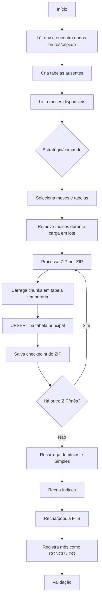

### 2.5 Leitura em chunks

Os CSVs internos dos ZIPs são muito grandes. O script usa:

```text
CHUNK_SIZE = 100.000 linhas
```

Assim, não precisa carregar todo o arquivo na memória.

Para cada chunk:

1. lê texto com separador `;` e codificação `latin-1`;
2. associa as colunas conforme o layout oficial;
3. insere na tabela temporária;
4. continua até terminar o ZIP.

### 2.6 Tabela temporária e UPSERT

Para `empresa`, `estabelecimento` e `socio`:

1. cria uma tabela temporária limpa;
2. carrega o conteúdo de um ZIP;
3. cria índice temporário;
4. executa `INSERT ... ON CONFLICT DO UPDATE`;
5. descarta a temporária.

**UPSERT** combina:

- inserir quando o registro ainda não existe;
- atualizar quando a chave já existe.

Isso permite usar a mesma lógica tanto na primeira carga quanto na atualização
mensal.

### 2.7 Chaves principais

| Tabela | Identificação principal |
|---|---|
| `empresa` | `cd_cnpjbasico` |
| `estabelecimento` | `cd_cnpjbasico + cd_cnpjordem` |
| `socio` | empresa + documento/nome + qualificação |

Na tabela `socio`, uma pessoa aparece várias vezes quando possui vínculos com
empresas diferentes. O registro representa um vínculo, não uma pessoa única.

### 2.8 Histórico e snapshot atual

O schema atual trata grupos de forma diferente:

- `empresa` e `estabelecimento`: atualizados por UPSERT;
- `socio`: meses podem preservar evidências de vínculos para inferir ativos e
  históricos;
- domínios e `simples`: substituídos pela foto mais recente processada.

### 2.9 Checkpoints e retomada

Após cada ZIP concluído, o script grava um checkpoint em
`tb_checkpoint_carga`.

Se a carga for interrompida:

- ZIPs concluídos são pulados;
- o processamento retoma do próximo;
- ao concluir o mês, checkpoints daquele mês são limpos;
- o resultado é registrado em `tb_processamento_mensal`.

### 2.10 Índices

Índices são estruturas auxiliares que aceleram buscas específicas, com custo
de espaço e de manutenção durante inserções.

Exemplos relevantes:

- empresa por razão social;
- estabelecimento por CNPJ básico;
- estabelecimento por nome fantasia;
- sócio por CNPJ básico;
- sócio por CPF;
- sócio por nome.

Durante cargas grandes, os índices secundários podem ser removidos e recriados
somente no final. Isso torna a escrita mais rápida.

### 2.11 FTS

FTS significa **Full-Text Search**.

As tabelas FTS armazenam uma representação otimizada para pesquisar palavras e
prefixos em textos grandes. No projeto:

- `fts_empresa` acelera pesquisa de razão social e nome fantasia;
- `fts_socio` acelera pesquisa por nome de sócio.

Fluxo:

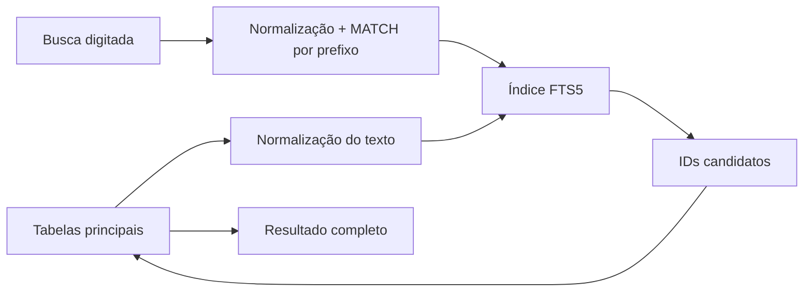

FTS não é uma cópia completa do banco para exibição. Ele é uma estrutura para
localizar candidatos rapidamente.

### 2.12 Validação final

`carga.py validar` confere:

- tabelas essenciais;
- índices essenciais;
- `fts_empresa`;
- `fts_socio`.

`reparar_busca.py` pode recriar índices e FTS sem refazer toda a carga.

---

## 3. Fluxo de inicialização do backend

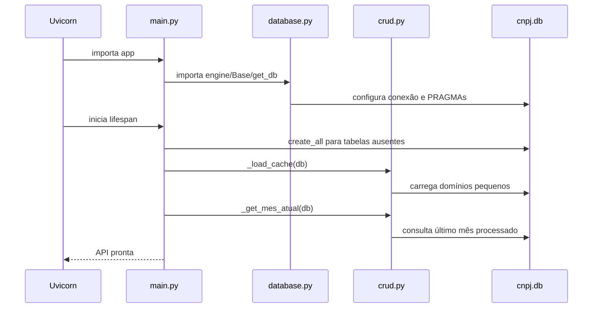

### PRAGMAs usados no SQLite

- `journal_mode=WAL`: melhora concorrência entre leituras e escrita;
- `cache_size`: reserva cache de páginas;
- `mmap_size`: permite leitura via memória virtual;
- `synchronous=NORMAL`: equilíbrio entre desempenho e segurança;
- `temp_store=MEMORY`: operações temporárias usam memória.

---

## 4. Fluxo da busca de empresa por nome

### Objetivo

Encontrar empresas por razão social ou nome fantasia enquanto o usuário digita.

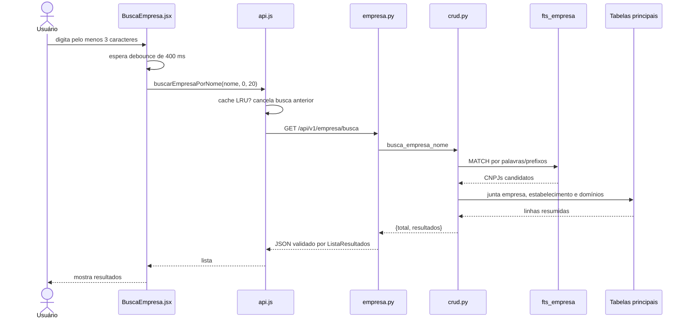

### Otimizações

- debounce;
- cancelamento da consulta anterior;
- cache no frontend;
- cache HTTP de 5 minutos;
- FTS5;
- paginação;
- `known_total` evita repetir contagem.

### Ao clicar no resultado

A lista é resumida. O clique consulta o CNPJ completo antes de abrir o perfil.

---

## 5. Fluxo da busca de empresa por CNPJ

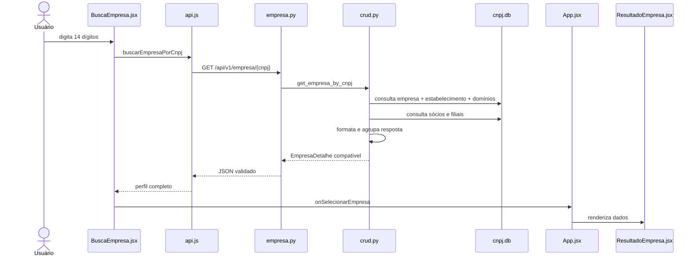

`get_empresa_by_cnpj` organiza dados que estão distribuídos em várias tabelas
em um único objeto preparado para a tela.

---

## 6. Fluxo da busca de sócio por nome

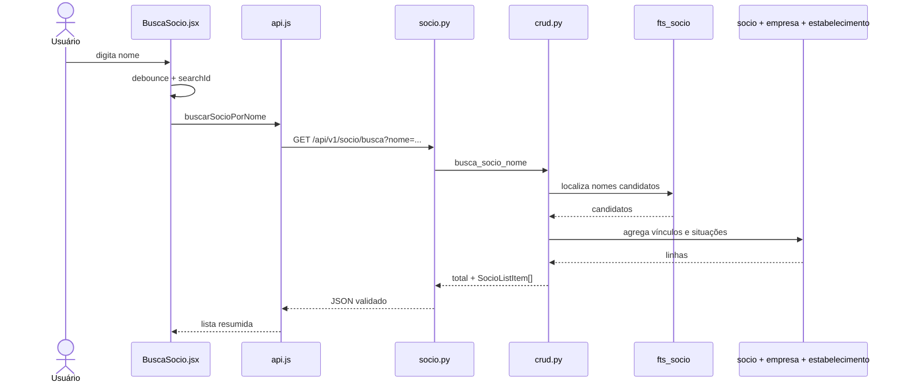

O resultado agrupa ocorrências do mesmo sócio e calcula indicadores como
empresas ativas, inaptas e vínculos anteriores.

---

## 7. Fluxo da busca de sócio por CPF

### Limitação da origem pública

Para pessoa física, o CPF aparece anonimizado. O projeto consegue comparar
somente os seis dígitos centrais disponíveis.

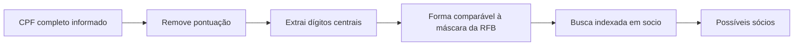

Mesmo com CPF completo, podem existir múltiplos resultados, pois seis dígitos
centrais não identificam uma pessoa de maneira única.

### Fluxo técnico

1. `BuscaSocio` decide que o termo é CPF.
2. `api.js` remove caracteres não numéricos.
3. A rota `/api/v1/socio/busca` prioriza `cpf`.
4. `crud.busca_socio_cpf` transforma o valor para a forma comparável.
5. O índice de CPF reduz o custo da consulta.
6. O CRUD agrupa e resume os vínculos encontrados.

O backend aceita somente 6 dígitos visíveis ou os 11 dígitos completos. Existe
hoje uma pequena inconsistência: o frontend também encaminha valores com 7 a
10 dígitos como CPF, mas esses valores não são convertidos pelo backend e
retornam lista vazia.

---

## 8. Fluxo do perfil detalhado de empresa

### Dados reunidos

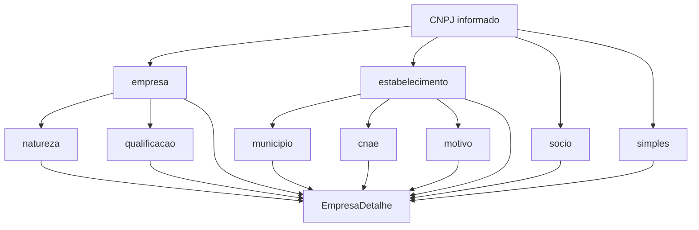

### Responsabilidade do CRUD

O CRUD:

- encontra empresa e estabelecimento solicitado;
- traduz códigos com tabelas de domínio;
- formata CNPJ e datas;
- separa CNAE principal e secundários;
- lista matriz e filiais;
- agrupa registros de sócios;
- infere vínculos atuais e históricos;
- separa sócios ativos e inativos.

O schema `EmpresaDetalhe` valida o formato final antes da resposta HTTP.

---

## 9. Fluxo do perfil detalhado de sócio

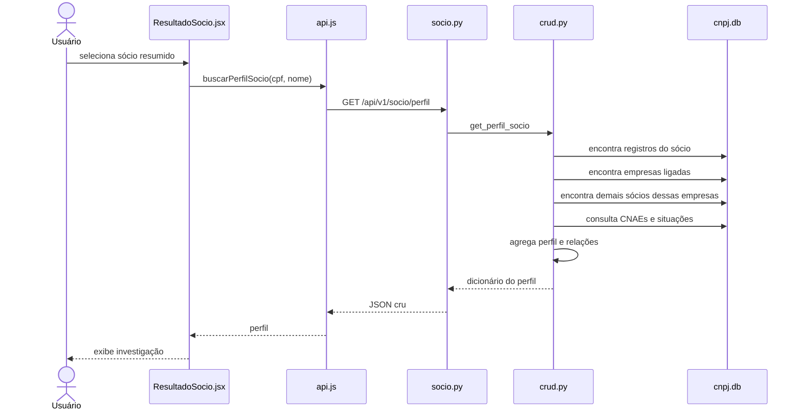

### Resultado conceitual

O perfil responde perguntas como:

- em quais empresas a pessoa aparece atualmente?
- em quais empresas já apareceu?
- quais pessoas compartilham empresas com ela?
- quais atividades econômicas aparecem em sua rede?
- qual capital social está associado às empresas relacionadas?

### Observação sobre schema

A rota de perfil não possui `response_model` específico. O dicionário montado
por `crud.py` é convertido diretamente para JSON pelo FastAPI.

---

## 10. Fluxo do mapa compacto de empresa

Endpoint:

```text
GET /api/v1/empresa/{cnpj}/rede
```

### Construção

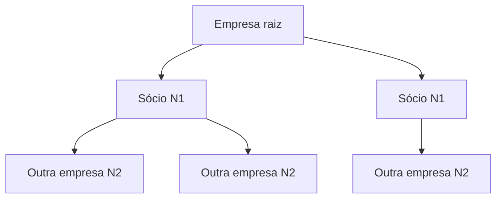

1. `ResultadoEmpresa` carrega o mapa apenas quando a seção é aberta.
2. `crud.get_empresa_rede` encontra os sócios da empresa.
3. Para cada sócio, encontra outras empresas ligadas.
4. Monta resposta hierárquica com `children`.
5. `RedeEmpresa` estiliza e desenha a árvore.

Esta rota não usa `response_model`; a estrutura hierárquica vem do CRUD.

---

## 11. Fluxo do mapa compacto de sócio

O frontend monta a árvore usando dados já presentes em `perfil`.

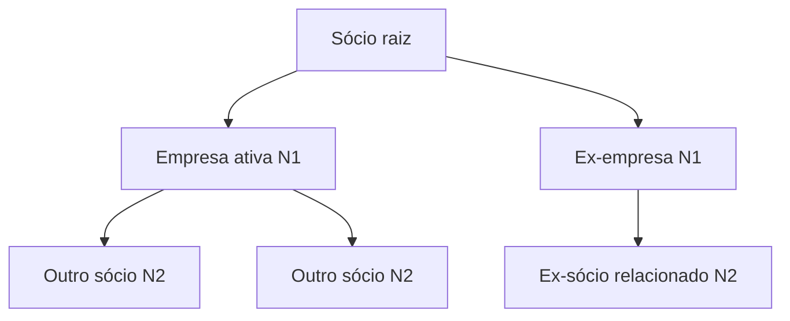

1. `ResultadoSocio` recebe o perfil.
2. `RedeSocio` combina `socios_comuns` e `ex_socios_comuns`.
3. Para cada empresa, filtra os sócios associados ao CNPJ básico.
4. Limita a quantidade de filhos por empresa para proteger a interface.
5. Monta uma árvore e envia ao ECharts.

Não existe nova consulta exclusiva para esse mapa compacto.

---

## 12. Fluxo da rede completa

A rede completa usa expansão BFS, ou **busca em largura**.

### Conceito BFS

Primeiro visita todos os nós a um salto da raiz; depois todos a dois saltos;
depois a três, até a profundidade pedida ou algum limite.

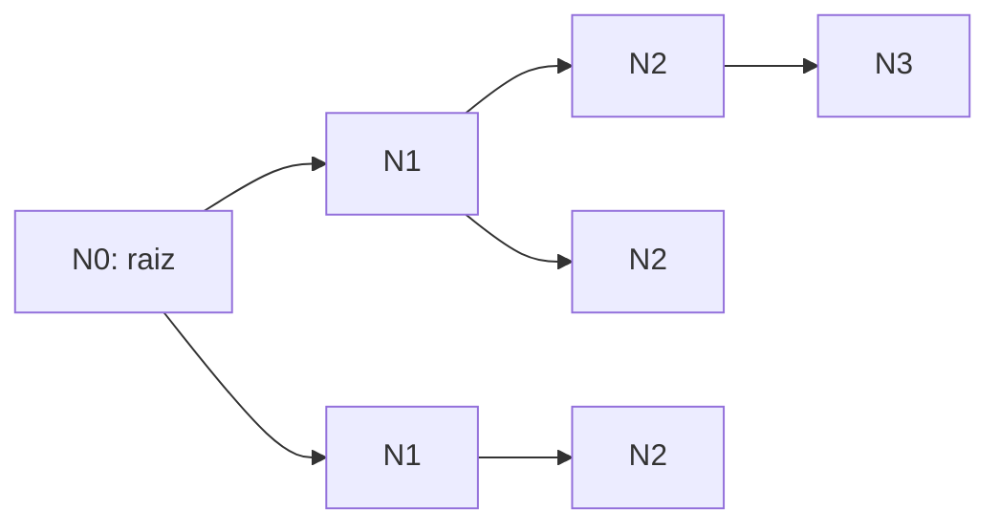

### Alternância dos níveis

Se a raiz é empresa:

```text
Empresa → Sócios → Empresas → Sócios → ...
```

Se a raiz é sócio:

```text
Sócio → Empresas → Sócios → Empresas → ...
```

### Resposta do backend

Conceitualmente:

```json
{
  "nodes": [
    {
      "id": "empresa:12345678",
      "name": "EMPRESA EXEMPLO",
      "category": 0,
      "is_root": true
    }
  ],
  "links": [
    {
      "source": "empresa:12345678",
      "target": "socio:***123456**",
      "ativo": true
    }
  ],
  "categories": [],
  "nivel_alcancado": 2,
  "pode_aprofundar": true,
  "truncado": false
}
```

### Fluxo

1. Usuário abre “Rede completa”.
2. `App.jsx` guarda `grafoRaiz`.
3. `GrafoRede` começa com profundidade 2.
4. `api.js` chama a rota adequada.
5. `crud.get_grafo_rede` expande a rede por BFS.
6. Backend devolve nós e links planos.
7. ECharts calcula e desenha o layout.
8. Ao trocar N, ocorre uma nova consulta.

### Controles do frontend

- seleção de profundidade;
- filtro de categorias;
- filtro de ex-vínculos;
- busca textual;
- menor caminho até a raiz;
- pan, zoom e tela cheia;
- duplo clique para navegar a outro perfil.

---

## 13. Fluxo da informação de mês atual

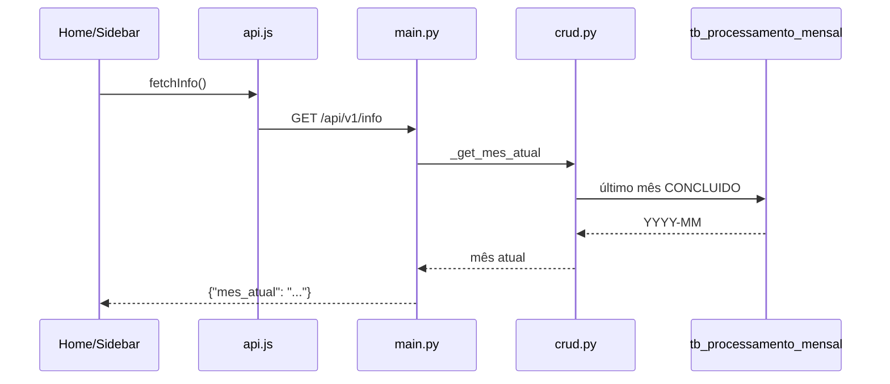

Esse mês representa a referência mais recente registrada como concluída no
banco, não necessariamente a data atual do calendário.

---

## 14. Fluxo de erros

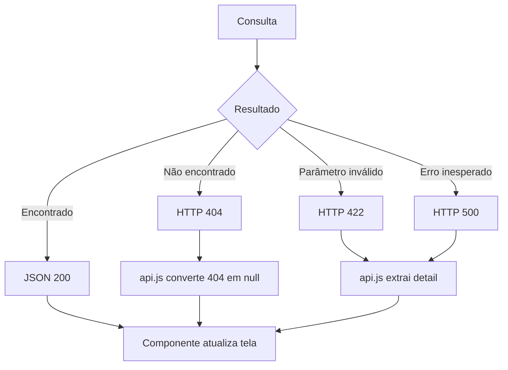

O frontend mostra mensagens de erro quando disponíveis e mantém resultados
anteriores visíveis durante algumas novas buscas.

---

## 15. Fluxo mensal operacional recomendado

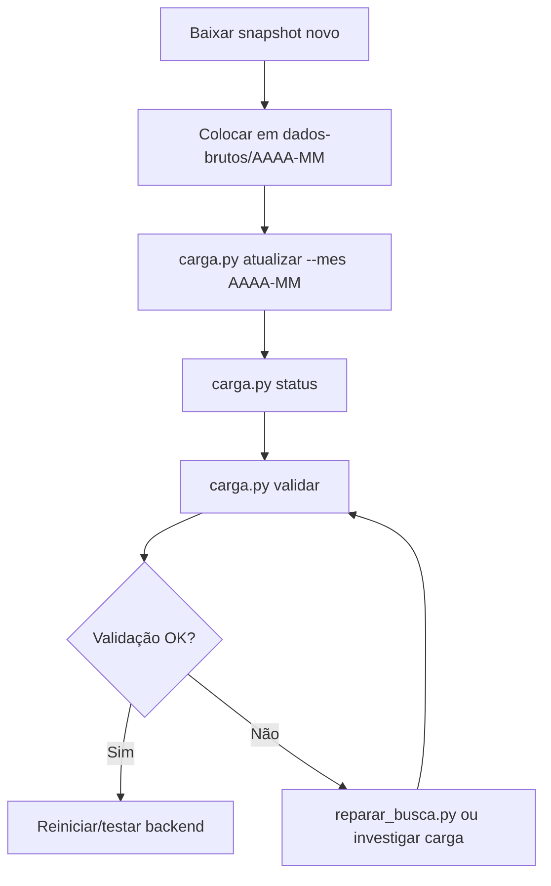

Após atualizar o banco, o backend deve ser reiniciado para garantir que caches
em memória e o mês atual reflitam o novo estado.

---

## 16. Onde cada transformação acontece

| Transformação | Local principal |
|---|---|
| ZIP/CSV para tabela SQL | `backend/scripts/carga/carga.py` |
| Criação/reparo de índices e FTS | `carga.py` e `reparar_busca.py` |
| Conexão, sessão e PRAGMAs | `backend/app/database.py` |
| Representação SQLAlchemy | `backend/app/models.py` |
| Consulta e agregação de negócio | `backend/app/crud.py` |
| Validação de algumas respostas | `backend/app/schemas.py` |
| Parâmetros e HTTP | `backend/app/routers/` |
| Cache/cancelamento HTTP | `frontend/src/api.js` |
| Estado e navegação | `frontend/src/App.jsx` |
| Apresentação e interação | `frontend/src/components/` |

---

## 17. História curta para explicar o projeto

1. Todo mês, a Receita publica arquivos grandes e separados.
2. O projeto organiza esses arquivos em um banco consultável.
3. Índices e FTS tornam viáveis buscas em tempo real.
4. O backend cruza os registros necessários e monta respostas de investigação.
5. O frontend transforma as respostas em perfis e mapas de relacionamento.
6. O usuário consegue visualizar vínculos que seriam demorados de cruzar
   manualmente.

---

## 18. Limitações e interpretação correta

- O projeto auxilia investigação; ele não prova fraude.
- Um vínculo societário não significa, sozinho, irregularidade.
- Dados dependem da atualização e da qualidade da fonte pública.
- CPF anonimizado pode gerar múltiplas pessoas candidatas.
- Sócios em comum indicam compartilhamento de empresa, não necessariamente
  relação pessoal direta.
- Situações históricas são inferidas a partir dos snapshots disponíveis.
- Redes muito grandes precisam ser limitadas para manter desempenho e clareza.
