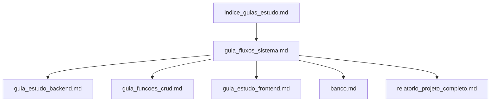

# Índice dos Guias de Estudo

Este é o ponto de entrada recomendado para estudar o projeto ou enviar os
documentos ao NotebookLM.

---

## Ordem recomendada de leitura

### 1. Visão geral e fluxos

Leia primeiro:

- `guia_fluxos_sistema.md`

Esse arquivo apresenta a história completa: dados públicos, banco, backend,
frontend, buscas, perfis e grafos.

### 2. Backend

Leia:

- `guia_estudo_backend.md`
- `guia_funcoes_crud.md`

O primeiro explica a arquitetura. O segundo detalha cada função de consulta.

### 3. Frontend

Leia:

- `guia_estudo_frontend.md`

Ele explica componentes React, navegação, API, busca em tempo real, resultados
e gráficos.

### 4. Banco e operação

Leia:

- `banco.md`

Ele contém estratégias, comandos e procedimentos para criar, atualizar,
validar e reparar o banco.

### 5. Contexto de negócio e apresentação

Leia:

- `relatorio_projeto_completo.md`
- `template_relatorio_respostas.md`

Eles apresentam problema, objetivo, público, limitações e evolução futura.

---

## Mapa dos documentos



---

## Perguntas que cada guia responde

| Pergunta | Guia |
|---|---|
| Como o projeto funciona de ponta a ponta? | `guia_fluxos_sistema.md` |
| Como a API inicia e organiza suas camadas? | `guia_estudo_backend.md` |
| O que cada função do CRUD faz? | `guia_funcoes_crud.md` |
| Como o React e cada componente funcionam? | `guia_estudo_frontend.md` |
| Como criar e atualizar o banco? | `banco.md` |
| Qual dor o projeto resolve? | `relatorio_projeto_completo.md` |

---

## Roteiro de estudo para prova

### Bloco 1: conte a história

Treine explicar sem olhar:

```text
ZIPs mensais → carga.py → SQLite/indexação → FastAPI/CRUD →
api.js → componentes React → perfis e mapas
```

### Bloco 2: explique uma busca

Escolha busca de empresa por nome:

```text
digitação → debounce → api.js → router → CRUD → FTS →
resultado resumido → clique → perfil detalhado
```

Depois repita para sócio e CPF.

### Bloco 3: compare os mapas

| Mapa compacto | Rede completa |
|---|---|
| Série `tree` do ECharts | Série `graph` do ECharts |
| Hierárquico até N2 | Nós e arestas planos |
| Dentro do perfil | Tela dedicada |
| Foco em leitura rápida | Foco em exploração |
| Empresa usa rota `/rede` | Usa rotas `/grafo` |
| Sócio monta com o perfil | Backend expande por BFS |

### Bloco 4: explique desempenho

Mencione:

- chunks na carga;
- UPSERT;
- checkpoints;
- índices;
- FTS5;
- cache de domínios;
- PRAGMAs SQLite;
- debounce;
- cancelamento de requisições;
- cache LRU;
- paginação e `known_total`;
- limites para redes grandes.

---

## Sugestões de pedidos para o NotebookLM

### Para gerar apresentação visual

> Crie uma apresentação visual explicando o fluxo ponta a ponta do sistema,
> desde os ZIPs mensais da Receita Federal até os perfis e mapas exibidos ao
> usuário. Separe preparação dos dados, busca em tempo real, perfil de empresa,
> perfil de sócio, mapa compacto e rede completa.

### Para estudar arquitetura

> Explique a arquitetura em camadas e crie perguntas de prova sobre a
> responsabilidade de main.py, database.py, models.py, schemas.py, routers,
> crud.py, api.js, App.jsx e componentes.

### Para estudar os fluxos

> Gere diagramas de sequência para busca de empresa por nome, busca por CNPJ,
> busca de sócio por nome, busca por CPF, perfil detalhado e grafo BFS.

### Para simular prova oral

> Faça perguntas uma por vez sobre o projeto. Após minha resposta, corrija
> conceitos errados e peça que eu explique o fluxo seguinte sem consultar o
> material.

---

## Resumo de uma frase por camada

| Camada | Explicação |
|---|---|
| Dados brutos | Snapshots mensais públicos ainda separados e compactados |
| Carga | Transforma arquivos grandes em tabelas consultáveis |
| Índices/FTS | Permitem localizar dados sem varrer milhões de linhas |
| Models | Representam as tabelas no SQLAlchemy |
| CRUD | Consulta, cruza, interpreta e formata informações |
| Routers | Expõem operações como endpoints HTTP |
| Schemas | Validam formatos de algumas respostas |
| `api.js` | Liga o React ao backend com cache e cancelamento |
| `App.jsx` | Controla navegação e seleção atual |
| Componentes | Apresentam e permitem explorar os resultados |

